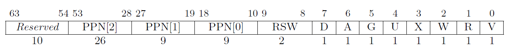

# lab2/ch4实验报告

## 实验

借助页表实现的 `translated_byte_buffer()` 得以重写 `sys_get_time()` 和 `sys_task_info()` ，其中获取毫秒级时间的函数改为了使用获取微秒级时间获取函数避免精度问题。此外的实现基本和lab1相同。

对于 mmap 和 munmap 的实现主体位于 `os/src/task/task.rs` 和 `os/src/mm/memory_set.rs` 下。

## 简答题

#### 1.

V: valid，标记是否合法

R/W/X: read/write/execute，读写执行权限

U: user page，是否为用户态可访问

G: global，全局可访问，用于io等

A/D: accessed/dirty，此bit被清零后是否被访问/修改过。

#### 2.

可能导致缺页异常的有：访问错误地址，最终导致段错误；访问的内容不在内存中，需要从磁盘交换；访问的内容在内存中，但是没有被MMU记录到页表里。

satp寄存器存储了根页表的地址。

可以使得程序中始终未被使用的部分免于被加载，节约内存空间并提高运行速度。

多级页表依次所表示的空间（全部展开）依次为 4KB, 2MB, 1GB, 可知三种页表项依次有 2621440, 5120, 10个，每个页表项 8B， 可知数量级大约为 2e7 Bytes.

在页表项的保留位中额外取出一位设置lazy位，mmap时不实际分配而在发生缺页异常时再次实际分配。

对应页表项的Valid标记为0.

#### 3.

修改satp寄存器即可。

操作页表项的U位。

易于实现，减少切换次数，提高性能。

发生各种广义上的异常（系统调用，陷入，异常等），也即发生用户态和内核态的切换的时候。

## 荣誉准则

1. 在完成本次实验的过程（含此前学习的过程）中，我曾分别与 以下各位 就（与本次实验相关的）以下方面做过交流，还在代码中对应的位置以注释形式记录了具体的交流对象及内容：

        无

2. 此外，我也参考了 以下资料 ，还在代码中对应的位置以注释形式记录了具体的参考来源及内容：

        无

3. 我独立完成了本次实验除以上方面之外的所有工作，包括代码与文档。 我清楚地知道，从以上方面获得的信息在一定程度上降低了实验难度，可能会影响起评分。

4. 我从未使用过他人的代码，不管是原封不动地复制，还是经过了某些等价转换。 我未曾也不会向他人（含此后各届同学）复制或公开我的实验代码，我有义务妥善保管好它们。 我提交至本实验的评测系统的代码，均无意于破坏或妨碍任何计算机系统的正常运转。 我清楚地知道，以上情况均为本课程纪律所禁止，若违反，对应的实验成绩将按“-100”分计。